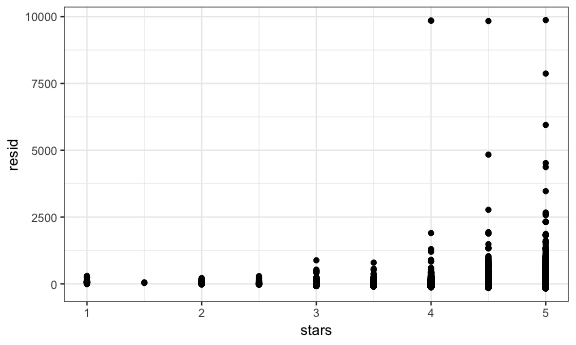
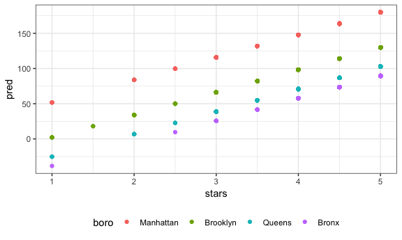
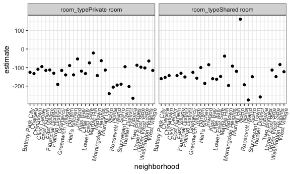
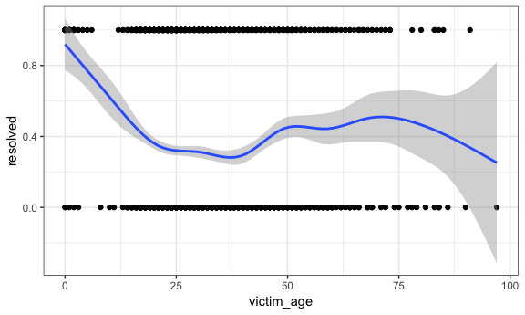

Linear Models
================

Examples
--------

``` r
library(tidyverse)
library(p8105.datasets)

set.seed(1)
```

#### Introduce broom

``` r
data("nyc_airbnb")

nyc_airbnb = 
  nyc_airbnb %>% 
  mutate(stars = review_scores_location / 2) %>% 
  rename(boro = neighbourhood_group,
         neighborhood = neighbourhood) %>% 
  filter(boro != "Staten Island") %>% 
  select(price, stars, boro, neighborhood, room_type)

fit = lm(price ~ stars + boro, data = nyc_airbnb)
```

look at some summaries

``` r
summary(fit)
summary(fit)$coef
coef(fit)
fitted.values(fit)
```

look at a better summaries by broom

``` r
fit %>% 
  broom::tidy() %>% 
  select(term, estimate, p.value) %>% 
  mutate(term = str_replace(term,"^boro", "Boro: ")) %>% # replace start with boro to Boro:
  knitr::kable(digits = 3)
```

| term            |  estimate|  p.value|
|:----------------|---------:|--------:|
| (Intercept)     |   -70.414|    0.000|
| stars           |    31.990|    0.000|
| Boro: Brooklyn  |    40.500|    0.000|
| Boro: Manhattan |    90.254|    0.000|
| Boro: Queens    |    13.206|    0.145|

More in broom

``` r
fit %>% 
  broom::glance() %>% 
  select(r.squared, adj.r.squared)
## # A tibble: 1 x 2
##   r.squared adj.r.squared
## *     <dbl>         <dbl>
## 1    0.0342        0.0341
```

Be careful with factors...

``` r
nyc_airbnb = 
  nyc_airbnb %>% 
  mutate(boro = fct_infreq(boro),
         room_type = fct_infreq(room_type))
fit = lm(price ~ stars + boro, data = nyc_airbnb)
fit %>% broom::tidy()
## # A tibble: 5 x 5
##   term         estimate std.error statistic   p.value
##   <chr>           <dbl>     <dbl>     <dbl>     <dbl>
## 1 (Intercept)      19.8     12.2       1.63 1.04e-  1
## 2 stars            32.0      2.53     12.7  1.27e- 36
## 3 boroBrooklyn    -49.8      2.23    -22.3  6.32e-109
## 4 boroQueens      -77.0      3.73    -20.7  2.58e- 94
## 5 boroBronx       -90.3      8.57    -10.5  6.64e- 26
```

#### Diagnostics

``` r
modelr::add_residuals(nyc_airbnb, fit) %>% 
  ggplot(aes(x = stars, y = resid)) +
  geom_point()
## Warning: Removed 9962 rows containing missing values (geom_point).
```



``` r

nyc_airbnb %>% 
modelr::add_residuals(fit) %>% 
  ggplot(aes(x = stars, y = resid)) +
  geom_point()
## Warning: Removed 9962 rows containing missing values (geom_point).
```


``` r


nyc_airbnb %>% 
modelr::add_predictions(fit) %>% View()

nyc_airbnb %>% 
modelr::add_predictions(fit) %>% 
  ggplot(aes(x = stars, y = pred, color = boro)) +
  geom_point()
## Warning: Removed 9962 rows containing missing values (geom_point).
```



#### Testing

``` r
fit %>% 
  broom::tidy()
## # A tibble: 5 x 5
##   term         estimate std.error statistic   p.value
##   <chr>           <dbl>     <dbl>     <dbl>     <dbl>
## 1 (Intercept)      19.8     12.2       1.63 1.04e-  1
## 2 stars            32.0      2.53     12.7  1.27e- 36
## 3 boroBrooklyn    -49.8      2.23    -22.3  6.32e-109
## 4 boroQueens      -77.0      3.73    -20.7  2.58e- 94
## 5 boroBronx       -90.3      8.57    -10.5  6.64e- 26
```

compare nested models.

``` r
fit_null = lm(price ~ stars + boro, data = nyc_airbnb)
fit_alt = lm(price ~ stars + boro + room_type, data = nyc_airbnb)
anova(fit_null, fit_alt) %>% 
  broom::tidy()
## Warning: Unknown or uninitialised column: 'term'.
## # A tibble: 2 x 6
##   res.df         rss    df     sumsq statistic p.value
## *  <dbl>       <dbl> <dbl>     <dbl>     <dbl>   <dbl>
## 1  30525 1005601724.    NA       NA        NA       NA
## 2  30523  921447496.     2 84154228.     1394.       0
```

#### Nested data

``` r
nyc_airbnb %>% 
  lm(price ~ stars * boro + room_type * boro, data = .) %>% 
  broom::tidy() %>% 
  knitr::kable(digits = 3)
```

| term                                |  estimate|  std.error|  statistic|  p.value|
|:------------------------------------|---------:|----------:|----------:|--------:|
| (Intercept)                         |    95.694|     19.184|      4.988|    0.000|
| stars                               |    27.110|      3.965|      6.838|    0.000|
| boroBrooklyn                        |   -26.066|     25.080|     -1.039|    0.299|
| boroQueens                          |    -4.118|     40.674|     -0.101|    0.919|
| boroBronx                           |    -5.627|     77.808|     -0.072|    0.942|
| room\_typePrivate room              |  -124.188|      2.996|    -41.457|    0.000|
| room\_typeShared room               |  -153.635|      8.692|    -17.676|    0.000|
| stars:boroBrooklyn                  |    -6.139|      5.237|     -1.172|    0.241|
| stars:boroQueens                    |   -17.455|      8.539|     -2.044|    0.041|
| stars:boroBronx                     |   -22.664|     17.099|     -1.325|    0.185|
| boroBrooklyn:room\_typePrivate room |    31.965|      4.328|      7.386|    0.000|
| boroQueens:room\_typePrivate room   |    54.933|      7.459|      7.365|    0.000|
| boroBronx:room\_typePrivate room    |    71.273|     18.002|      3.959|    0.000|
| boroBrooklyn:room\_typeShared room  |    47.797|     13.895|      3.440|    0.001|
| boroQueens:room\_typeShared room    |    58.662|     17.897|      3.278|    0.001|
| boroBronx:room\_typeShared room     |    83.089|     42.451|      1.957|    0.050|

Nesting and then fitting

``` r
# stratify analysis
nest_lm_res =
  nyc_airbnb %>% 
  group_by(boro) %>% 
  nest() %>%
  mutate(models = map(data, ~lm(price ~ stars + room_type, data = .x)), # map in each group
         models = map(models, broom::tidy)) %>% 
  select(-data) %>% # get models for each boro
  unnest()
# but those models are separate have no interaction
```

look at the neighborhood in Manhattan

``` r
manhattan_airbnb =
  nyc_airbnb %>% 
  filter(boro == "Manhattan")

manhattan_nest_lm_res =
  manhattan_airbnb %>% 
  group_by(neighborhood) %>% 
  nest() %>% 
  mutate(models = map(data, ~lm(price ~ stars + room_type, data = .x)),
         models = map(models, broom::tidy)) %>% 
  select(-data) %>% 
  unnest()
```

View results

``` r
manhattan_nest_lm_res %>% 
  filter(str_detect(term, "room_type")) %>% 
  ggplot(aes(x = neighborhood, y = estimate)) +
  geom_point() +
  theme(axis.text.x = element_text(angle = 80, hjust = 1)) +
  facet_grid(~term)
```



#### Binary outcomes

``` r
baltimore_df = 
  read_csv("data/homicide-data.csv") %>% 
  filter(city == "Baltimore") %>% 
  mutate(resolved = as.numeric(disposition == "Closed by arrest"),
         victim_age = as.numeric(victim_age),
         victim_race = fct_relevel(victim_race, "White")) %>% 
  select(resolved, victim_age, victim_race, victim_sex)
## Parsed with column specification:
## cols(
##   uid = col_character(),
##   reported_date = col_integer(),
##   victim_last = col_character(),
##   victim_first = col_character(),
##   victim_race = col_character(),
##   victim_age = col_character(),
##   victim_sex = col_character(),
##   city = col_character(),
##   state = col_character(),
##   lat = col_double(),
##   lon = col_double(),
##   disposition = col_character()
## )
```

``` r
fit_logistic = 
  baltimore_df %>% 
  glm(resolved ~ victim_age + victim_race, data = ., family = binomial()) 
# telling that the model you are model is binomial family
summary(fit_logistic)
## 
## Call:
## glm(formula = resolved ~ victim_age + victim_race, family = binomial(), 
##     data = .)
## 
## Deviance Residuals: 
##     Min       1Q   Median       3Q      Max  
## -1.4651  -0.9209  -0.8935   1.4467   1.6433  
## 
## Coefficients:
##                      Estimate Std. Error z value Pr(>|z|)    
## (Intercept)          0.535470   0.206039   2.599  0.00935 ** 
## victim_age          -0.006147   0.003260  -1.886  0.05933 .  
## victim_raceAsian     0.242438   0.648110   0.374  0.70835    
## victim_raceBlack    -1.026360   0.169652  -6.050 1.45e-09 ***
## victim_raceHispanic -0.449746   0.311939  -1.442  0.14937    
## victim_raceOther    -1.028579   0.881681  -1.167  0.24337    
## ---
## Signif. codes:  0 '***' 0.001 '**' 0.01 '*' 0.05 '.' 0.1 ' ' 1
## 
## (Dispersion parameter for binomial family taken to be 1)
## 
##     Null deviance: 3676  on 2826  degrees of freedom
## Residual deviance: 3631  on 2821  degrees of freedom
## AIC: 3643
## 
## Number of Fisher Scoring iterations: 4
```

``` r
fit_logistic %>% 
  broom::tidy() %>% 
  mutate(OR = boot::inv.logit(estimate)) %>% 
  knitr::kable(digits = 3)
```

| term                 |  estimate|  std.error|  statistic|  p.value|     OR|
|:---------------------|---------:|----------:|----------:|--------:|------:|
| (Intercept)          |     0.535|      0.206|      2.599|    0.009|  0.631|
| victim\_age          |    -0.006|      0.003|     -1.886|    0.059|  0.498|
| victim\_raceAsian    |     0.242|      0.648|      0.374|    0.708|  0.560|
| victim\_raceBlack    |    -1.026|      0.170|     -6.050|    0.000|  0.264|
| victim\_raceHispanic |    -0.450|      0.312|     -1.442|    0.149|  0.389|
| victim\_raceOther    |    -1.029|      0.882|     -1.167|    0.243|  0.263|

``` r
# not a very good plot but nice enough for exploring the data 
baltimore_df %>% 
  ggplot(aes(x = victim_age, y = resolved)) + geom_point() + geom_smooth()
## `geom_smooth()` using method = 'gam' and formula 'y ~ s(x, bs = "cs")'
```


